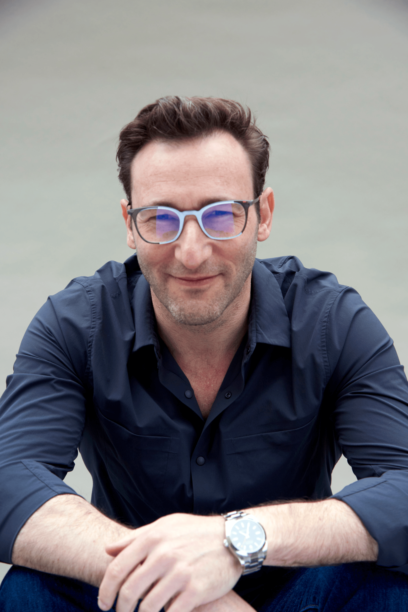

Familia, gente, motos, bailar, contar y que me cuente. La tecnología como medio para hacer a los h@mbres mas humanos.

### Más Información

Sé que hay mucha gente que cree, o quiere creer, en que lo establecido no es la única manera y que si todos nos pusiéramos de acuerdo podríamos cambiar las cosas. Sé que hay mucha gente cree que uno solo no cambia nada, y que si no jugamos a lo que juegan los demás saldrá perdiendo.

Pues sí, habrá un tiempo donde unos pocos seremos considerados "tontos" e "ingenuos", donde parecerá que saldremos perdiendo en el trato con otros y  aunque admirados, pocos creerán que actuar con honor, fieles a la verdad y a nosotros mismos servirá de algo.
Pero yo digo que servirá de ejemplo para otros y para nuestros hijos. Que poco a poco se perderá el miedo a lo que me puedan hacer y dejaremos de vivir a la defensiva. Dejaremos de vivir en el individualismo y volveremos a sentirnos en comunidad dando sentido a nuestras vidas ayudando y conviviendo con otros.

En muchos lugares del mundo nunca lo perdieron. Ahora nos toca, a los países "mas desarrollados", volver a encontrarnos. 
Dejemos de correr buscando la felicidad delante, volvámonos y nos daremos cuenta que la felicidad la dejamos atrás hace mucho.

Buscamos conocer el Espacio cuando aún no conocemos los océanos. Buscamos la felicidad lejos cuando aun no nos conocemos a nosotros mismos.

> Dejemos de correr mirando y aprendamos a ver estando.

## Referencias

<!--  -->

[Simon Sinek](https://simonsinek.com/about/simon-sinek)

[Brené Brown](https://brenebrown.com/)

[Emilio Duró](http://www.emilioduro.es/)
  

### Contacta me

[@rulasg](https://twitter.com/rulasg)